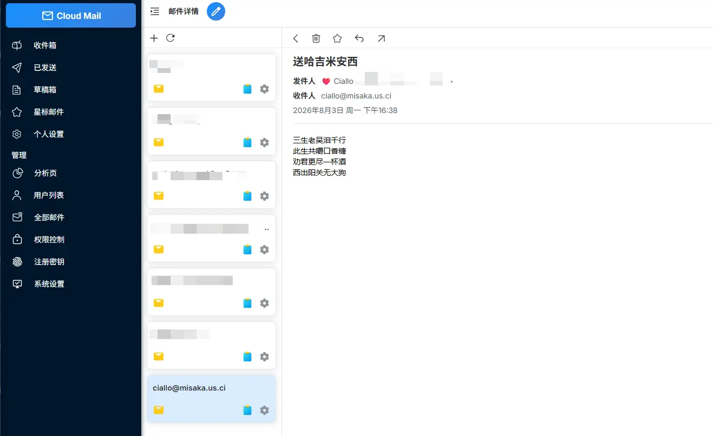
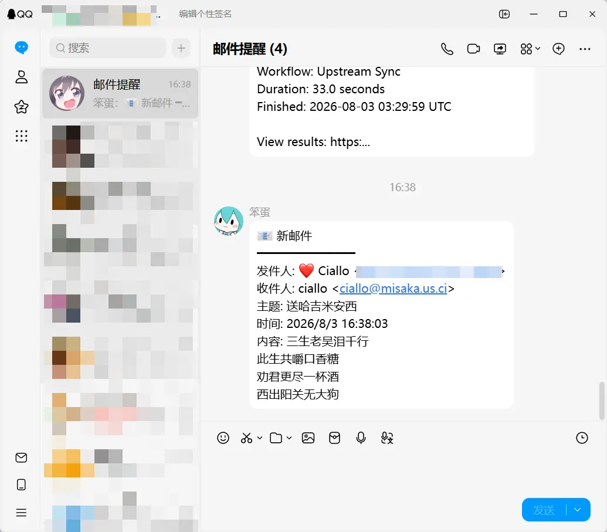
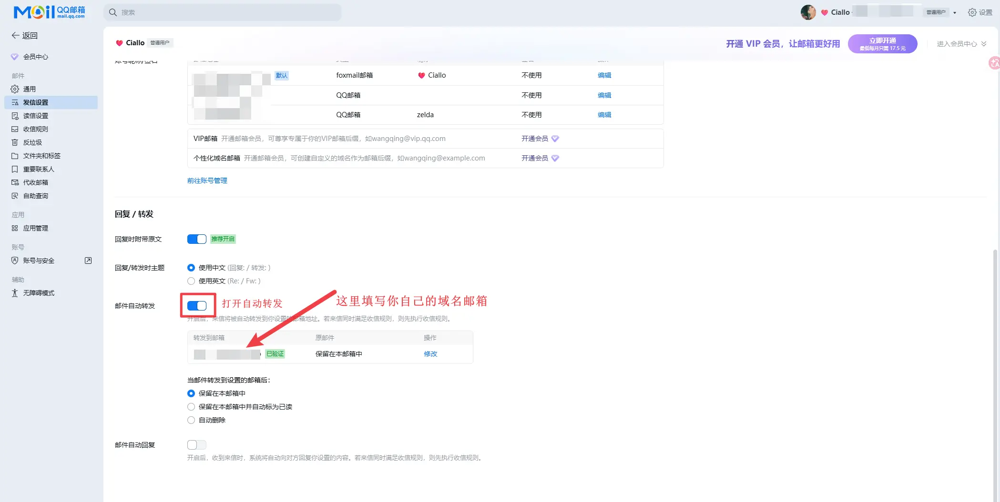
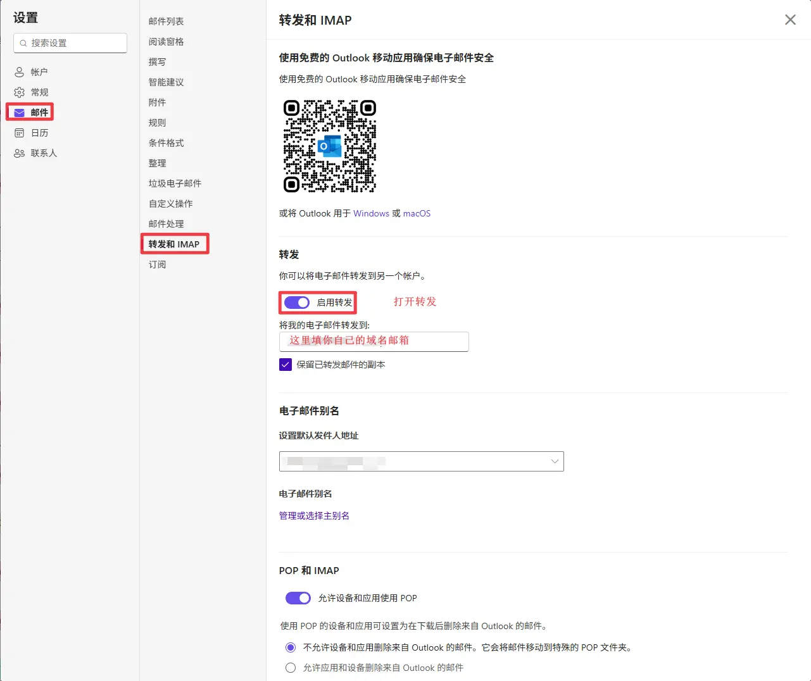

## 前言

你手里有几个邮箱？我有七八个，被这事儿整整折磨了半年。

企业邮箱对接工作、QQ 邮箱收验证码、Outlook 处理海外邮件，还有 163 邮箱和我自己的域名邮箱，用途拆得越细，管起来越乱。更离谱的是：上班盯钉钉飞书，下班刷微信 QQ，全天挂着即时通讯软件，偏偏邮箱通知永远被晾在一边，半天想不起来看。

每天挨个刷一遍 App，十几分钟就没了，提心吊胆怕漏事，翻到底大半都是垃圾邮件。最坑的是手机通知还经常延迟，上次就因为晚看了半小时合作邮件，差点把项目节点拖黄，气得我当场就想把邮箱全卸载。

忍无可忍我就横下心：与其天天被动踩坑，不如自己动手，直接把这病根拔了。思路很简单，就抓两个核心：所有邮件统一进一个入口，再用我最不会漏的渠道发强提醒。

具体分三步走：
第一步，所有邮箱全开自动转发，不管发到哪个地址的邮件，全部实时汇进我的域名邮箱，散件先归总。
第二步，部署一套 Cloud Mail 邮件服务，稳稳接住所有域名邮件。不光相当于有了无限容量的专属邮箱，平时注册陌生服务、不想泄露主邮箱怕收垃圾邮件，随手生成个别名地址就能用，垃圾邮件沾不到主号，隐私安全直接拉满。
最关键的第三步，接上插件化通知系统：邮件一入库，自动解析出发件人、标题和内容摘要，立刻推到 QQ、微信、钉钉、飞书、企业微信，也支持 Telegram。全是天天挂后台的即时通讯软件，通知优先级拉满，就算开了免打扰都能精准提醒，根本不可能漏。

现在用了快一个月，只能说爽到飞起。对方刚点完发送，我这边聊天软件直接弹窗，扫一眼就知道重不重要，验证码抬手就能复制。之前天天反复刷的邮箱 App，现在直接躺进文件夹深处，我再也没点开过。

最香的是，整套方案不用自己买服务器，Cloudflare 免费额度完全覆盖日常使用，成本直接为零。

## 使用效果展示

当邮件收到一封邮件时

收到了通知,带预览内容 (以 QQ 为例)

这样接受登录验证码非常方便,并且所有数据都保存在你自己的域名邮箱里, 非常的安全,不用担心隐私泄露

不过, 大多数人使用自己以前的邮箱 比如 QQ 邮箱,Outlook 之类的,我没有这些邮箱的域名, 能不能也能实现这个通知呢?

当然能, 只不过需要一点点设置, 我们可以前往你自己的邮箱,设置邮件转发到你自己的域名邮箱, 这样当你的邮箱收到邮件时,会转发到你的域名邮箱,然后就会有通知了

QQ 邮箱设置

outlook 设置

## 部署教程准备

1. 准备 [Github](https://github.com) 账号, [Cloudflare](https://dash.cloudflare.com/) 账号
2. 登录 [Github](https://github.com) , fork [这个项目](https://github.com/yinleren6/cloud-mail)

### 部署

项目部署在 cloudflare 上对海外网络延迟低, 邮件接受也很快

[参考原项目部署文档](https://doc.skymail.ink/)
